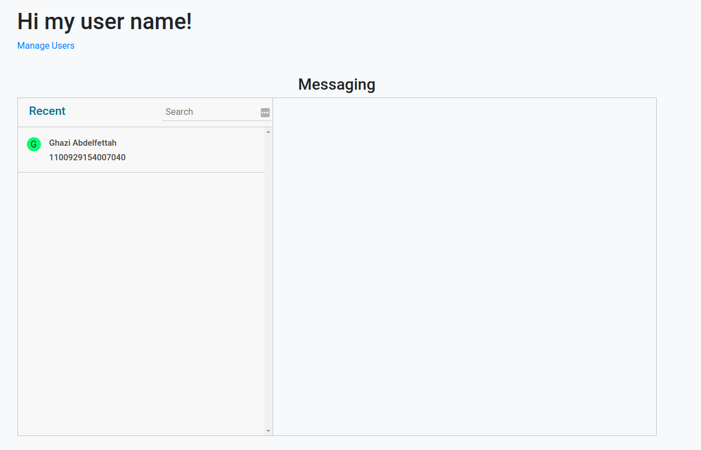
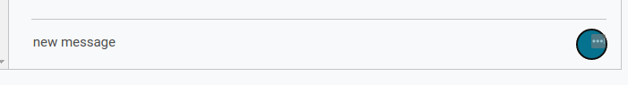

# chat-app
##Introduction
This project is a demo of a chat application. It contains two modules:
1. chat service (back-end) : Simple service which exposes a rest api as well as a websocket service. it provides : 
   * user management : signup, signin, logout.
   * logs for incoming and outgoing connections.
   * messaging : send, receive, retrieve messages

    Technologies : java, [spring](https://spring.io/projects/spring-framework), [mongodb](https://www.mongodb.com/)


2. chat web app (front end) : using [angular](https://angular.io/), [stompjs](https://github.com/stomp-js/stompjs)
## Requirements
* Java > 8
* Node > 14
* npm > 7 (or yarn)
* Node > 14
* MongoDB > 4
##Getting Started
1. Clone the project
```bash
git clone https://github.com/ghaziAbdou/chat-app.git
cd chat-app/
```
2. Build chat-service
```bash
mvn clean install -f ./chat-service/pom.xml
```
2. Start mongodb server & init database

The chat service uses mongodb as database. so before starting the service, mongodb must be started.

We need also to initialize the database, to do this we need to run the following script on mongodb server :
```bash
./chat-service/src/main/resources/init.db.js
```
You can execute the following commande directly if you have mongo client:
```bash
mongo localhost:27017/chat chat-service/src/main/resources/init.db.js
```
4. Start chat service
```bash
java -jar ./chat-service/target/chat-service-0.0.1-SNAPSHOT.jar
```
The server starts on port 8099 by default. You can change this by adding -Dserver.port to the previous commande :
```
java -jar -Dserver.port=8080 ./chat-service/target/chat-service-0.0.1-SNAPSHOT.jar
```
The service connect by default on mongodb on 'mongodb://localhost:27017/chat'. If mongodb is running on another address. we need to specify the mongodb uri when starting the service
```
java -jar -Dmongodb.uri=mongodb://localhost:27017/chat ./chat-service/target/chat-service-0.0.1-SNAPSHOT.jar
```
4. Build chat-web-app
```
cd chat-web-app/
npm install
```
5. Start the web app
```
ng serve
```
The web app starts on port 4200 by default. You can change this by changing add --port to the previous commande
```
ng serve --port 4201
```
##How to use
1. Access the web app on http://localhost:4200/.


2. Register new user


3. Login using psedo & password


4. Select a recipient



5.Send a new message



6. The recipient receives a notification when he receives a new message


7. We can display log history with infinite cursor-based paging


